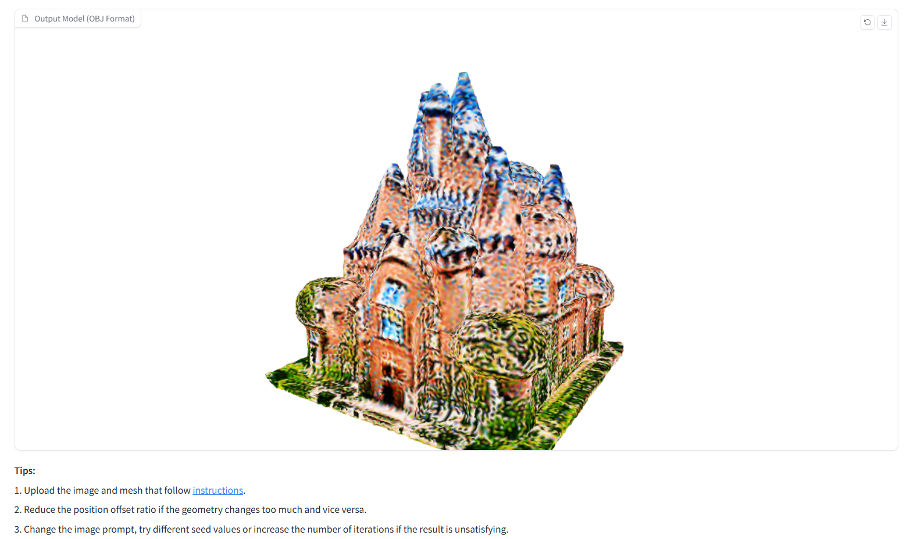

# 3D building model edit with generative AI
## Overview
Two methods for 3D model edit with generative AI are presented here, including Image Control X-Mesh (`XMeshimg`) and Combination of X-Mesh and Text2Tex (`Combination`). They can produce high-quality 3D model edit results with geometric changes and texture creation. The proposed methods are especially suitable for low-fidelity inputs. 

Image Control X-Mesh is modified from [X-Mesh](https://github.com/xmu-xiaoma666/X-Mesh). Instead of text prompts, the method allows user to use image prompts to guide the edit. The results can better follow the user control and be more realistic.   

Combination of X-Mesh and Text2Tex takes advantage of both [X-Mesh](https://github.com/xmu-xiaoma666/X-Mesh) and [Text2Tex](https://github.com/daveredrum/Text2Tex). The edited geometry from [X-Mesh](https://github.com/xmu-xiaoma666/X-Mesh) is used as input for [Text2Tex](https://github.com/daveredrum/Text2Tex) to provide richer depth information. It can generate smoother and more detailed textures.

<p align="center"></p>

## Setup
The code is tested on Ubuntu 20.04.6 LTS with a NVIDIA GPU with 24 GB RAM.

To run Image Control X-Mesh: 

```
# download the repository
git clone https://github.com/fengyingxin/MSc-Thesis.git

# setup the conda environment
conda env create --file environment.yml

# install other packages
pip install git+https://github.com/openai/CLIP.git
pip install kaolin==0.15.0 -f https://nvidia-kaolin.s3.us-east-2.amazonaws.com/torch-1.12.1_cu113.html

# install gradio (if needed)
pip install gradio 
```

To run Combination of X-Mesh and Text2Tex, first download the ControlNet Depth2img model (`control_sd15_depth.pth`) from the [hugging face page](https://huggingface.co/lllyasviel/ControlNet/tree/main/models), and put it under `Combination/Text2Tex/models/ControlNet/models/`.

Then follow the further steps:
``` 
# install PyTorch3D
conda install -c fvcore -c iopath -c conda-forge fvcore iopath
conda install -c bottler nvidiacub
conda install pytorch3d -c pytorch3d

# install xformers
conda install xformers -c xformers

# install other packages
pip install -r requirements.txt
```

For further information about setup,
see [X-Mesh](https://github.com/xmu-xiaoma666/X-Mesh) and [Text2Tex](https://github.com/daveredrum/Text2Tex).  

## Inputs
### Mesh
The open-source tool [MeshLab](https://www.meshlab.net/) can be used for mesh preprocessing. The input mesh for both methods should meet the below requirements and example meshes used in the thesis are provided in `Data`:
1. Y-axis is up and the mesh should face towards +X. The `Rotate` function of [MeshLab](https://www.meshlab.net/) can be used.
2. The mesh should be represented by small triangle faces. The `Subdivision Surfaces` function can be used.

The input mesh should look like the below image:
<p align="center"> </p> 


### Image prompt (Image control X-Mesh)
Here are suggestions for image prompts and example images can be found in `XMeshimg/prompt_image`:
1. The object should be complete and and take up the majority of the image.
2. Choose image from the representative angle (e.g. the front view of a building) to give more useful control.
3. Avoid the presence of barriers or irrelevant features.
4. The image should be high enough in resolution and square (512*512 is ideal).

### Text prompt (Combination of X-Mesh and Text2Tex)
Here are suggestions for text prompts and example texts can be found in `Combination/prompt_text.txt`:
1. Specify details, like type of the building, size, colour and material of key parts, additional features and the overall style.
2. If needed, add keywords for more realistic style images, like 'unreal engine' or 'DSLR photo'.
3. If needed, add keywords to get the complete architecture from the outside, like 'zoom-out' or 'exterior'.


## Usage
### Method 1: Image control X-Mesh
#### Run with command line
First check the `XMeshimg/image_xmesh.py` for all tunable parameters. You can change `XMeshimg/bash/example.sh` to meet your demand and use it for editing:
```
cd XMeshimg
python ./bash/example.sh
```

#### Use gradio
To start a local gradio demo, run:
```
cd XMeshimg
python image_xmesh_gradio.py
```
Only major parameters are provided for tuning and the process results are automatically stored in `outputs/xmeshimg` folder. Below is a successful sample:
<p align="center"> </p>
<p align="center"> </p>

### Method 2: Combination of X-Mesh and Text2Tex
#### Run with command line
First check the `Combination/combination.py` for all tunable parameters. You can change `Combination/bash/example.sh` to meet your demand and use it for editing:
```
cd Combination
python ./bash/example.sh
```

## Outputs


## Acknowledgement
The codes are based on [X-Mesh](https://github.com/xmu-xiaoma666/X-Mesh) and [Text2Tex](https://github.com/daveredrum/Text2Tex). Thanks for their excellent work!
